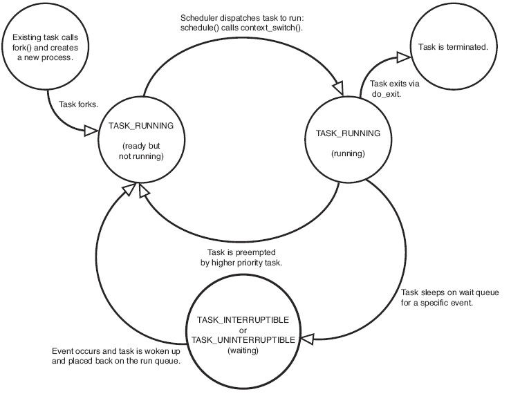
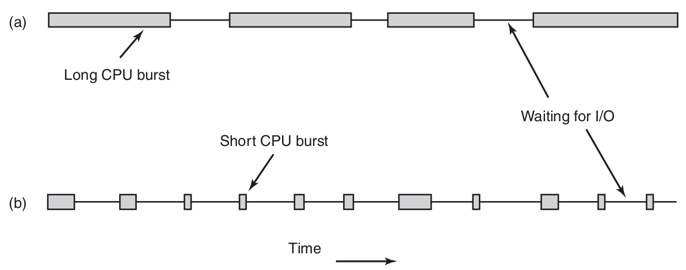

# Schedule
# 进程状态

# 进程的类型
* CPU密集型(CPU-bound or computer-bound)
* IO密集型(I/O-bound)

# 进程优先级
* nice: (-19 - 20)越高意味着更低的优先级
* 实时优先级: 越高意味着进程的优先级越高
* time slice: 进程所获得实际cpu时间和系统的负载密切相关
# 调度的主要任务
* which process should be run next.
* when invoking schedule.
	* fork
	* exit
	* block(I/O, singal, other)
	* I/O interrupt complete
	* Clock interrupt
* how long the process can run.
# 进程切换的代价
* 用户态切换到核心态
* 保存当前进程的状态
	* registers
	* memory image
* 运行调度算法
* 载入新进程的镜像到MMU
* 运行新进程
* 整个内存高速缓存失效,强迫高速缓存从主存中动态重新载入两次
# Non-preemptive VS preemptive Scheduling
** 非抢占式多任务 **
除非任务自己结束，否则将会一直执行
** 抢占式多任务 **

* 非抢占式调度算法，不会在时钟中断发生时进行调度
* 抢占式调度算法，在时间间隔的末端发生时钟中断，把CPU控制返回给Scheduler
# 调度算法的分类
* 批处理
* 交互式
* 实时
	* 有实时限制的系统中抢占有时并不需要
	* 实时系统与交互式系统的差别:
		* 实时系统只运行那些用来推进现有应用的程序
		* 交互式系统可以运行任意的非协作甚至是有恶意的程序
# 调度算法的目标
* 公平: 给每个(同类)进程的CPU份额
* 策略强制执行——看到所宣布的策略执行
* 平衡: 保持系统所有部分都忙碌
## 批处理
* 吞吐量: 每小时最大作业数
* 周转时间: 从提交到终止的最小时间
* CPU利用率: 保持CPU始终忙碌
## 交互式
* 响应时间
* 均衡性——满足用户的期望
## 实时
* 满足截止时间
* 可预测性: 在多媒体系统中避免品质降低
# 参考资料
* Modern Operating Systems (4th Edition), Andrew S. Tanenbaum, Herbert Bos
* Linux Kernel Development (3rd Edition), Robert Love
* https://en.wikipedia.org/wiki/Scheduling_%28computing%29
