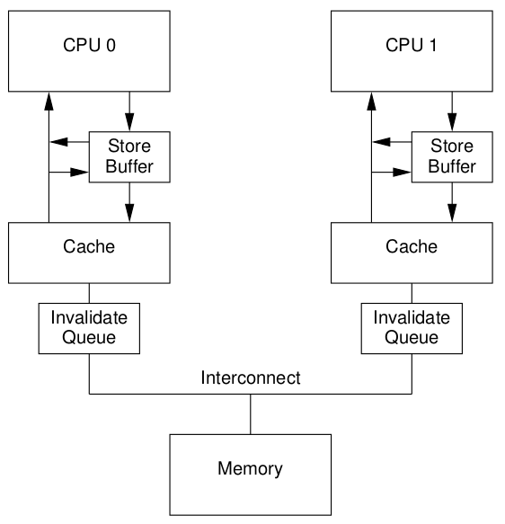

# Computer organization and design : The Hardware/Software Interface

## 概述
* 农业革命
* 工业革命
* 信息革命

**计算机分类**
* 个人计算机
* 服务器
* 嵌入式计算机

**计算机系统结构中的８个伟大思想**
* 面向摩尔定律设计: 单芯片上的集成度每18-24个月翻一番.
* 抽象化设计: abstraction/model.
* 加速大概率事件: performance.
* 通过并行提高性能
* 通过流水线提高性能
* 通过预测提高性能
* 存储器层次
* 通过冗余提高可靠性

**性能**
* 响应时间: 是计算机完成某任务所需的时间，包括硬件访问，内存访问，I/O活动，操作系统开销和CPU执行时间等.
* 吞吐率: 也叫带宽，性能的另一种度量参数，表示单位时间内完成的任务数量.

## 指令

**instruction set**
计算机语言的基本单词称为指令，一个计算机的全部指令称为该计算机的指令集.

* RISC: MIPS, ARM
* CISC: x86/x86_64

MIPS操作数

| Name            | I.E.                                                         | Annotation                               |
| --------------- | ------------------------------------------------------------ | ---------------------------------------- |
| registers(32个) | $s0-$s7, $t0-$t7,$zero,$a0-$a3,$v0-$v1,%gp,$fp, $sp, $ra,$at | MIPS只能对存放在寄存器中数据执行算术操作 |

| Instruction | I.E.            | 含义        | Annotation |
| ----------- | --------------- | ----------- | ---------- |
| ADD         | add $s1,$s2,$s3 | $s1=$s2+$s3 | 三个寄存器操作数           |
| SUB         | sub $s1,$s2,$s3 | $s1=$s2-$s3 |            |
| ADDI        | addi $s1,$s2,20 | $s1=$s2+20  |            |
| Load Word   | lw $s1,20($s2)  | $s1=[$s2+20]|            |
| Store Word  | sw $s1,20($s2)  | [$s2+20]=$s1|            |
| Load Half W | lh              |             |            |
| Load Unsigned Half | lhu      |             |            |
| Sb	      | sb $s1,20($$s2) |             |            |
| load link   | ll $s1,20($s2)  | $s1=[$s2+20]|取字作为原子交换的前半部 |
|	      | sc $s1,20($s2)  | [$s2+20]=$s1:$s1=0or1 |存字作为原子交换的后半部 |
|	      | lui $s1,20	| $s1=20\*2^16 |	取立即数放到高16位 |
|	| and $s1,$2,$3	| $s1=$s2&$s3 |	 |
|	| or $s1,$2,$3	| $s1=$2\|$3 |	 |
|	| nor $s1,$s2,$s3	| $s1=~($s2\|$s3) |	 |
|	| andi $s1,$s2,20	|  |	 |
|	| ori	|  |	 |
|	| sll $s1,$s2,10	| $s1=$s2<<10 |	 |
|	| srl	|  |	 |
|	| beq $s1,$s2,25	| if($s1==$s2) goto PC+4+100 |	 |
|	| bne $s1,$s2,25	|  |	 |
|	| slt $s1,$s2,$s3	| if($s2==$s3) $s1=1,else $s1=0 |	 |
|	| j 2500	| goto 2500\*4 |	 |
|	| jr $ra	|  |	 |
|	| jal 2500	| $ra=PC+4, goto 1000 |	 |

**每条MIPS算术指令只执行一个操作，并且有且仅有三个变量**

**MIPS体系中寄存器的大小是32bits**
* MIPS是按字节编址的，所以字的起始地址必须是４的倍数，对齐限制(alignment restriction).
* MIPS采用的是大端编址(big-endian).
~~~
  int 0x12345678
  big-endian:   --------------------------------->
  						0x12 0x34 0x56 0x78
  little-endian : -------------------------------->
  						0x78 0x56 0x34 0x12
~~~
~~~c
BOOL IsBigEndian()
{
    union NUM
    {
        int a;
        char b;
    }num;
    num.a = 0x1234;
    if( num.b == 0x12 )
    {
        return TRUE;
    }
    return FALSE;
}
~~~

**负数: 二进制补码. (取反加１).**

* 指令的表示
	指令在计算机内部是以若干或高或低的电信号的序列表示的，并且形式上和数的表示相同.

	* $a0-$a3 : 用于传递参数的４个参数寄存器
	* $v0-$v1 : 用于返回值的两个值寄存器
	* $ra : 用于返回起始点的返回地址寄存器

MIPS:               X86:
jal		             call
jr $ra		        ret

PC: 程序计数器，存放下一条将要被执行指令的地址的寄存器.

* PUSH: addi $sp,$sp,-4; sw $s1,0($sp)

* POP:  lw $s1,0($sp); addi $sp,$sp,4

## Registers in MIPS, X86_64 and ARM
* MIPS:
~~~
$t0-$t9: 10个临时寄存器,在过程调用中不必被调用者(被调用者)保存.
$s0-$s7: 8个保留寄存器,在过程调用中必须被保存(由被调用着保存和恢复).
~~~
* X86_64:
~~~
rbx,rbp,r12,r13,r14,r15		被调用者保存
r10,r11						调用者保存

rdi,rsi,rdx,rcx,r8,r9		入参
rax							返回值

STI:
CLI:
~~~
* ARM

  | register | AKA  | Use                                                          |
  | -------- | ---- | ------------------------------------------------------------ |
  | r0       |      | Return value, first function argument                        |
  | r1-r3    |      | Function arguments and general scratch                       |
  | r4-r11   |      | Saved registers, general registers                           |
  | r12      | ip   | Intra-procedure scratch register, rarely used by the linker  |
  | r13      | sp   | Stack pointer, a pointer to the end of the stack.  Moved by push and pop |
  | r14      | lr   | Link register, storing the address to return to when the function is done. Written by "bl" (branch and link, like function call), often saved with a push/pop sequence, read by "bx lr" (branch to link register) or the pop. |
  | r15      | pc   | Program counter, the current memory address being executed   |
~~~
User Mode  SVC Mode   IRQ Mode   FIQ Mode  APCS

R0 ------- R0 ------- R0 ------- R0        a1
R1 ------- R1 ------- R1 ------- R1        a2
R2 ------- R2 ------- R2 ------- R2        a3
R3 ------- R3 ------- R3 ------- R3        a4
R4 ------- R4 ------- R4 ------- R4        v1
R5 ------- R5 ------- R5 ------- R5        v2
R6 ------- R6 ------- R6 ------- R6        v3
R7 ------- R7 ------- R7 ------- R7        v4
R8 ------- R8 ------- R8         R8_fiq    v5
R9 ------- R9 ------- R9         R9_fiq    v6
R10 ------ R10 ------ R10        R10_fiq   sl
R11 ------ R11 ------ R11        R11_fiq   fp
R12 ------ R12 ------ R12        R12_fiq   ip
R13        R13_svc    R13_irq    R13_fiq   sp
R14        R14_svc    R14_irq    R14_fiq   lr
------------- R15 / PC -------------       pc  

User Mode: the usual mode for applications to run in.
Supervisor Mode (SVC Mode): used mainly by SWIs and the OS. This mode has additional privileges which allow greater control of the computer.
Interrupt Mode (IRQ Mode): used to handle peripherals that issues interrupts.
Fast Interrupt Mode (FIQ Mode): used to handle peripherals that issue fast interrupts.

R15 is built up as follows:
  Bit  31  30  29  28  27  26  25------------2  1  0

       N   Z   C   V   I   F   Program Counter  S1 S0

N  Negative        Set if result is negative
Z  Zero            Set if result is zero
C  Carry           Set if carry occurs
O  Overflow        Set if overflow occurs
I  IRQ             Interrupt disable
F  FIQ             Fast Interrupt disable

S1   S0   Mode
0    0    USR - User mode
0    1    FIQ - Fast Interrupt mode
1    0    IRQ - Interrupt mode
1    1    SVC - Supervisor mode

MOV     R0, #3          ; Load a bit mask (%11) into R0
AND     R0, R0, PC      ; AND R15 into R0, to get the mode status
CMP     R0, #3          ; Compare mode with '3' (SVC)
BEQ     svc             ; If SVC mode, branch to 'svc'
CMP     R0, #2          ; Compare mode with '2' (IRQ)
BEQ     irq             ; If IRQ mode, branch to 'irq'
CMP     R0, #1          ; Compare mode with '1' (FIQ)
BEQ     fiq             ; If FIQ mode, branch to 'fiq'
CMP     R0, #0          ; Compare mode with '0' (USR)
BEQ     usr             ; If USR mode, branch to 'usr'

B     Branch
BL    Branch with Link
BX lr			;

LDR	: load into register
STR	: store

//读取或设置中断的flags
MRS Rd, <PSR>; //Rd := PSR
MSR <PSR>, Rd;	//

CPSID I; //disable interrupt
CPSIE I; //enable interrupt
CPSID F; //disable exception
CPSIE F; //enable exception
~~~
function call:

ARM:
push {fp}
add fp, sp, 0
or
push {fp, lr}
add fp, sp, #4
回溯需对应汇编
		---------------
			lr
	fp	---------------
			fp
	sp	---------------

pop {fp, sp}

**$fp 相当于 rbp**

X86_64

call
ret
		---------------
			ret
		---------------
			rbp
	rbp	---------------  rsp

~~~
	$sp --> 7fff fffc ------------
			     stack
			       |

			       |
			      heap
	$gp --> 1000 8000 ------------
			  static data
		1000 0000 ------------
			      text
	$pc	0040 0000 ------------
			   resevered
		       	0 ------------
~~~
**硬件原语**: 对存储单元进行园子读和原子写的能力，使得在进行存储器原子读和原子写操作时任何其他操作不得插入.

**ELF**:

* 目标文件头: 描述目标文件其他部分的大小和位置
* 代码段:
* 静态数据段: 在程序生命周期内分配的数据
* 重定位信息:
* 符号表
* 调试信息

## 计算机算术运算

* 加法: 数据从右到左逐位相加，同时进位也相应的向左传播
* 减法: 减数在简单的取反之后在进行加法操作

ALU: 算术逻辑单元,用于执行加法,减法,通常也包括如逻辑与，逻辑或等逻辑操作的硬件
异常: 也叫中断,一种打断正常程序执行过程的事件,用于溢出检测
中断: 来自处理器外部的异常

MIPS检测到溢出时会产生异常，异常和中断是一种打断正常过程的系统调用.产生溢出的指令地址保存在一个寄存器中，而后计算机会跳转到一个预先设定的地址去执行相应的异常处理程序.

MIPS异常程序计数器:EPC(Exception Program Counter)用来保存导致异常的指令地址.
**mfc0 $s1,$epc		//$s1=$epc**	复制异常PC到专用寄存器

* 乘法:　

**mult	$s2,$s3		#Hi,Lo=$s2*$s3**	//64位有符号积存在Hi,Lo
**multu $s2,$s3**			//无符号

**div	$s2,$s3			#Lo=$s2/$s3, Hi=$s2%$s3**	//Lo商,Hi余数
**mfhi	$s1				#$s1=Hi**
**mflo	$s1				#$s1=Lo**

## 处理器

计算机性能:
* 指令数目
* 时钟周期长度
* 每条指令所需时钟周期

### MIPS实现
* 存储器访问指令:lw/sw
* 算术逻辑指令: ALU/slt
* 分支指令: beq/j

### Pipelining
流水线是一种实现多条指令重叠执行的技术.
* MIPS五级流水线
	* 从指令存储器中读取指令,IF
	* 指令译码的同时读取寄存器,ID
	* 指令操作或计算地址,ALU
	* 从数据存储器中读取操作数,MEM   //load
	* 将结果写回寄存器,WB

**所有流水级(pipeline stage)都只花费一个时钟周期的时间,因此,时钟周期必须能够满足最慢操作的执行需求.**
**流水线所带来的性能提高是通过增加指令的吞吐量,而不是减少单条指令的执行时间实现的.**

#### 面向流水线的指令集设计
* 所有MIPS指令的长度是相同的，简化了第一级取指与第二级译码.
	* x86指令集中,指令的长度并不相同,1-15字节,最近x86体系结构实现上将x86指令转化成类似MIPS指令的简单操作,然后将这些简单操作进行流水,而不是直接对原始的x86指令流水.
* 所有操作必须在存储器中对齐.

流水线冒险:
* 结构冒险
	因缺乏硬件支持而导致指令不能在预定的时钟周期内执行
* 数据冒险
	因无法提供指令执行所需数据而导致指令不能在预定的时钟周期内执行. 下条指令依赖WB后寄存器中的数据,导致数据冒险.
		**旁路(bypassing)**:从内部寄存器而非程序员可见的寄存器或存储器提前取出数据.
		写寄存器操作发生在时钟周期的前半端而读寄存器操作发生在时钟周期的后半段.
* 控制冒险
	分支冒险: 预测.
		**分支预测**: 保留每次分支的历史记录,然后利用这个历史记录来预测.
		**nop指令**.
		**清除**: 因发生意外而丢弃流水线中的指令.

#### 异常
在异常程序计数器(EPC)中保存出错指令的地址，并把控制权转交给操作系统的特定地址.

* 向量中断
在向量中断中,控制权被转移到由异常原因决定的地址.

在流水实现中,异常可被视作另一种形式的控制冒险.

**硬件与操作系统必须协同工作才能按照我们期望的方式处理异常.**
硬件一般暂停指令流中导致异常的指令,同时执行完该指令前的所有指令,清除该指令后的所有指令,并且设置一个寄存器描述异常发生的原因,保存导致异常发生的指令的地址,然后跳转到预先确定的地址开始执行.
操作系统则查看异常发生的原因并采取相应的操作.

#### 指令级并发
* 提交单元: 位于动态流水线和乱序流水线中的一个单元,用以决定何时可以安全的将操作结果送至程序员可见的寄存器和存储器.

* 保留站:　功能单元的缓冲区,用于保存操作数和操作.

* 重排序缓冲区: 动态调度处理器中用于暂时保存执行结果的缓冲区,等到安全时才将其中的结果写回寄存器和存储器.

  将操作数缓存在保留站中并将结果放在重排序缓冲区中,实际上提供了一种寄存器重命名机制.
~~~
					-------
		   			|IF/ID|
					-------
				           |					顺序发射
				-------------------------
				|	|	|	|
			      保留站  保留站  保留站   保留站
				|	|	|	|
		功能单元    整数单元  ...    浮点数单元  load/store		乱序执行
				|	|	|	|
					    |
					提交单元				顺序提交

~~~
* **ARM Cortex-A8**
  ARM Cortex-A8处理器主频为1GHz,具有14级流水线.采用动态多发射技术,每个时钟周期可以发射两条指令.

流水线包括取指令,指令译码和执行三个阶段.

* **Intel Core i7 920**
Intel取入x86指令,将其翻译为类MIPS指令,Intel称之为“微操作”.微操作由复杂的基于推测执行的动态调度流水线执行,该流水线每个时钟周期最多可以执行6个微操作.
	1. 取指令:　取指部件使用预测地址从指令cache中取入16字节.
	2. 预译码: 16字节放入预译码指令缓冲器. x86指令长度1-15字节.
	3. 微操作译码: 每条x86指令被翻译为微操作.
	4. 微操作缓冲器执行循环流检测
	5. 执行基本指令发射: 在将微操作发射到保留站之前,在寄存器表中查找寄存器位置,对寄存器进行重命名,分配重排序缓冲器器入口,从寄存器或重排序缓冲中取结果.
	6. 每个周期最多可以分派6个微操作
	7. 各个功能单元执行微操作,执行结果送往寄存器提交部件,还可以发送到一个等待的保留站.重排序缓冲中与指令对应入口标记为完成.
	8. 当前面一条或多条指令已被标记为完成,则执行寄存器提交部件中未决的写操作,指令从重排序缓冲器中移走.

## 存储器层次结构
* 时间局部性(temporal locality): 如果某个数据项被访问,那么在不久的将来它可能再次被访问.
* 空间局部性(soatial locality): 如果某个数据被访问,与它地址相邻的数据项也可能很快将被访问.

存储器层次结构: 一种有多存储器层次组成的结构,存储器的容量和访问时间随着离处理器距离的增加而增加.

SRAM
DRAM
SSD
HHD

### Cache的基本原理
cache是处理器和主存之间的特殊层次.

* 直接映射: 每个存储器地址仅仅对应到cache中的一个位置.
* 全相联映射: 块可以放到cache中的任何位置.
* 组相联映射: 块可以放到cache中的部分位置(至少两个).

tag: 表中的一个字段,包含了地址信息,这些地址信息可以用来判断cache中的字是否就是请求的字.
有效位: 表中的一个字段, 用来标识这个块是否含有一个有效数据.

~~~
cache line : 2^n
cache num  : 2^m

tag = 32 - m - n
index = m
offset = n
		31 ... 12 11 ... 2 1 0
		----------------------
		|	 |	 |   |
		----------------------
		tag	index    offset

		--------------------------
		|Inv| tag	| data	 |
		--------------------------
		|Inv| tag	| data	 |
		--------------------------
 index	->	|Inv| tag	| data	 |
		--------------------------
		|Inv| tag	| data	 |
		--------------------------
~~~
* cache缺失
cache缺失引起流水线阻塞,与中断不同,中断发生时需保存所有寄存器的状态.

**写操作处理**
write buffer: 当一个数据在等待被写入主存时,先将它写入写缓冲中.当把数据写入cache和写缓冲后,处理器可以继续执行.当写主存操作完成后,写缓冲里的数据项也得到释放.
~~~
	L1
	Write buffer		//硬件负责写到DDR
	DDR

	两路组相联
	   tag  data tag  data
     组　------------------------
     0	|-----|-----|-----|-----|
     1  |-----|-----|-----|-----|
　　 2  |-----|-----|-----|-----|

Physical Address: | tag	| index | offset |
~~~
替换块的选择: LRU

### 虚拟存储器
Address space: 物理地址和虚拟地址的映射,加强了各个程序地址空间之间的保护.
页表(page table): 存储在主储中.保存着虚拟地址和物理地址之间转换关系.
硬件包含一个指向页表首地值的寄存器,称为页表寄存器.

* 一些计算机提供了一个引用位(PG_referenced in struct page),当一页被访问时该位被置位,操作系统定期将引用位清零,然后重新记录.
	硬件设置referenced位(TLB).如果没有硬件支持,操作系统通过其他方式来评估那些页被访问过.
	* handle_mm_fault
		handle_pte_fault
			pte_mkyoung
			ptep_set_access_flags //set the referenced flag in page structure
	read/write访问
	* mark_page_accessed
		SetPageReferenced

#### TLB
* TLB: 用于记录最近使用地址的映射信息的高速缓存,从而可以避免每次都要访问页表.
每次访问,都要在TLB中查找虚拟页号,如果命中,物理页号就用来形成地址,相应的引用位被置位.如果是写操作,脏位置位.
发生TLB缺失,需替换.由于TLB表项中包含引用位和脏位,需要把这些位复制回页表项中.
~~~
		31 ...12 11 ...  0
		------------------
		|_______|_OFFSET_|
		    |
		------------------------
	TLB	| I | D | R | TAG | PA |
		------------------------
				    |
		------------------  |
	L1	| I | TAG | DATA |-------
		-----------------	|
				       DDR

I: invalid
D: dirty
R: referenced
PA: physical address
~~~

* cache替换算法由硬件实现. LRU或随机替换.

* Intel Core i7
虚拟地址: 48
物理地址: 44
	页表	: 4k or 2/4M
	TLB	: 硬件处理TLB缺失
	  每核1个指令TLB和1个数据TLB,均为4路相联,LRU替换策略
	  L2 TLB 4路相联,LRU替换

* ARM Cortex A8
虚拟地址: 32
物理地址: 32
页表大小: 4/16/64K/1M/16M
	TLB	: 硬件处理TLB缺失
	  1个指令TLB和1个数据TLB,均为全相联,轮转替换策略

* 预取: 使用特殊指令将未来可能用到的制定地址的cache块提前搬到cache中的一种技术,许多微处理器使用硬件预取来尝试预测访问.
	* prefetch
	* prefecthw

## cache一致性
* 监听协议(snooping)

**MESI**
* M: modified
* E: exclusive
* S: shared
* I: invalid

* Store Buffer:
	1. barrier smp_mb() will cause the CPU to flush its store buffer before applying each subsequent store to its variable’s cache line.
	2. 写内存屏障为当前存储缓冲区中的所有数据做标记,如果存储缓冲器中有标记过的数据,那么后面的存储指令只能把数据写到存储缓冲区中,不能写到缓存中.
	I.E.
		CPU0				CPU1
		a = 1;				while (b == 0) continue;	//只能读取CPU0 cache中数据,不能读取store buffer中的数据
		smp_wmb();			assert(a == 1);			//需等待flush后才可见.
		b = 1;

* Invalidate queue: 
	1. S: 发送使无效队列,处理器把使无效消息放到使无效队列中,立即发送使无效确认信息,不需要执行使缓存无效的操作.
	2. RMB: 阻止后续的读操作,应先处理使无效队列,再执行操作.
