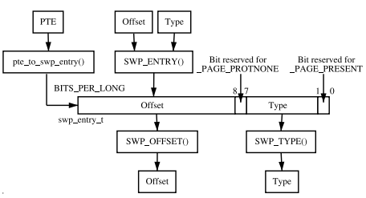

# Swap management

Just as Linux uses free memory for purposes such as buffering data from disk, there eventually is a need to free up private or anonymous pages used by a process. These pages, unlike those backed by a file on disk, can not be simply discarded to be read later. Instead they have to be carefully copied to backing storage, called the swap cache.

* It expands the amount of memory a process may use. Virtual memory and swap cache allows a large process to run even if the process is only partially resident.
* A significant number of the pages referenced by a process early in its life may only be used for initialisation and then never used again.

## do_anonymous_page

## dup_mmap

.png)

## COW

## Non-anonymous mapping
.png)

## Swap_cache
The principal reason for the existance of this cache is to eliminate unnecessary disk reads.

* Anonymous pages exist in a special aspect of the page cache called swap cache when slots are allocated in the backing storage for page-out.
* Pages belonging to shared memory regions are treated in a similar fashion to anonyous pages.
**The only difference between Anonymous pages and Shared pages is that shared pages are added to the swap cache and space reserved in backing storage immediately after the first write to the page.**

## Swap Area
~~~c
extern struct swap_info_struct *swap_info[MAX_SWAPFILES];

/*
 * The in-memory structure used to track swap areas.
 */
struct swap_info_struct {
        unsigned long   flags;          /* SWP_USED: active SWP_WRITEOK: SWP_USED|SWP_WRITEABLE */
        signed short    prio;           /* swap priority of this type */
        struct plist_node list;         /* entry in swap_active_head */
        struct plist_node avail_list;   /* entry in swap_avail_head */
        signed char     type;           /* strange name for an index */
        unsigned int    max;            /* extent of the swap_map */
        unsigned char *swap_map;        /* vmalloc'ed array of usage counts */
        struct swap_cluster_info *cluster_info; /* cluster info. Only for SSD */
        struct swap_cluster_info free_cluster_head; /* free cluster list head */
        struct swap_cluster_info free_cluster_tail; /* free cluster list tail */
        unsigned int lowest_bit;        /* index of first free in swap_map */
        unsigned int highest_bit;       /* index of last free in swap_map */
        unsigned int pages;             /* total of usable pages of swap */
        unsigned int inuse_pages;       /* number of those currently in use */
        unsigned int cluster_next;      /* likely index for next allocation */
        unsigned int cluster_nr;        /* countdown to next cluster search */
        struct percpu_cluster __percpu *percpu_cluster; /* per cpu's swap location */
        struct swap_extent *curr_swap_extent;
        struct swap_extent first_swap_extent;
        struct block_device *bdev;      /* swap device or bdev of swap file */
        struct file *swap_file;         /* seldom referenced */
        unsigned int old_block_size;    /* seldom referenced */
#ifdef CONFIG_FRONTSWAP
        unsigned long *frontswap_map;   /* frontswap in-use, one bit per page */
        atomic_t frontswap_pages;       /* frontswap pages in-use counter */
#endif
        spinlock_t lock;                /*
                                         * protect map scan related fields like
                                         * swap_map, lowest_bit, highest_bit,
                                         * inuse_pages, cluster_next,
                                         * cluster_nr, lowest_alloc,
                                         * highest_alloc, free/discard cluster
                                         * list. other fields are only changed
                                         * at swapon/swapoff, so are protected
                                         * by swap_lock. changing flags need
                                         * hold this lock and swap_lock. If
                                         * both locks need hold, hold swap_lock
                                         * first.
                                         */
        struct work_struct discard_work; /* discard worker */
        struct swap_cluster_info discard_cluster_head; /* list head of discard clusters */
        struct swap_cluster_info discard_cluster_tail; /* list tail of discard clusters */
};
~~~

Each swap area is divided up into a number of pages sized slots on disk which means that each slot is 4096 bytes on the x86 for example.

The first slot is always reserved as it contains information about the swap area that should not be overwritten.
* The first 1K of the swap area is used to store a disk label for the partition that can be picked up by userspace tools.
* The remaining space is used for information about the swap area which is filled when the swap area is created with the system program **mkswap**.

~~~c
/*
 * Magic header for a swap area. The first part of the union is
 * what the swap magic looks like for the old (limited to 128MB)
 * swap area format, the second part of the union adds - in the
 * old reserved area - some extra information. Note that the first
 * kilobyte is reserved for boot loader or disk label stuff...
 *
 * Having the magic at the end of the PAGE_SIZE makes detecting swap
 * areas somewhat tricky on machines that support multiple page sizes.
 * For 2.5 we'll probably want to move the magic to just beyond the
 * bootbits...
 */
union swap_header {
        struct {
                char reserved[PAGE_SIZE - 10];
                char magic[10];                 /* SWAP-SPACE or SWAPSPACE2 */
        } magic;
        struct {
                char            bootbits[1024]; /* Space for disklabel etc. */
                __u32           version;
                __u32           last_page;	/* The last usable page in the area */
                __u32           nr_badpages;	/* Bad pages */
                unsigned char   sws_uuid[16];
                unsigned char   sws_volume[16];
                __u32           padding[117];	/* version - padding is a disk sector, 512 bytes */
                __u32           badpages[1];	/* bad page slots */
        } info;
};
~~~

## Mapping Page Table Entries to Swap Entries
When a page is swapped out, Linux uses the corresponding PTE to store enough information to locate the page on disk again.
~~~c
	31	27/25		0
	-------------------------
	| TYPE	|    OFFSET	|
	-------------------------
	63	59/57		0
 /*
  * A swap entry has to fit into a "unsigned long", as the entry is hidden
  * in the "index" field of the swapper address space.
  */
typedef struct {
        unsigned long val;
} swp_entry_t;
~~~
~~~c
/*
 * swapcache pages are stored in the swapper_space radix tree.  We want to
 * get good packing density in that tree, so the index should be dense in
 * the low-order bits.
 *
 * We arrange the `type' and `offset' fields so that `type' is at the seven
 * high-order bits of the swp_entry_t and `offset' is right-aligned in the
 * remaining bits.  Although `type' itself needs only five bits, we allow for
 * shmem/tmpfs to shift it all up a further two bits: see swp_to_radix_entry().
 *
 * swp_entry_t's are *never* stored anywhere in their arch-dependent format.
 */
#define SWP_TYPE_SHIFT(e)       ((sizeof(e.val) * 8) - \
                        (MAX_SWAPFILES_SHIFT + RADIX_TREE_EXCEPTIONAL_SHIFT))
#define SWP_OFFSET_MASK(e)      ((1UL << SWP_TYPE_SHIFT(e)) - 1)

/*
 * Store a type+offset into a swp_entry_t in an arch-independent format
 */
static inline swp_entry_t swp_entry(unsigned long type, pgoff_t offset)
{
        swp_entry_t ret;

        ret.val = (type << SWP_TYPE_SHIFT(ret)) |
                        (offset & SWP_OFFSET_MASK(ret));
        return ret;
}

/*
 * Extract the `type' field from a swp_entry_t.  The swp_entry_t is in
 * arch-independent format
 */
static inline unsigned swp_type(swp_entry_t entry)
{
        return (entry.val >> SWP_TYPE_SHIFT(entry));
}

/*
 * Extract the `offset' field from a swp_entry_t.  The swp_entry_t is in
 * arch-independent format
 */
static inline pgoff_t swp_offset(swp_entry_t entry)
{
        return entry.val & SWP_OFFSET_MASK(entry);
}
~~~

* ARCHITECTURE SWAP ENTRY

  
~~~c
X86	31		 10    5/7   1 0
	----------------------------------
	|   OFFSET        |     |TYPE   P|
	----------------------------------

#define _PAGE_BIT_PRESENT       0       /* is present */
#define _PAGE_BIT_GLOBAL        8       /* Global TLB entry PPro+ */ 
/* If _PAGE_BIT_PRESENT is clear, we use these: */
/* - if the user mapped it with PROT_NONE; pte_present gives true */
#define _PAGE_BIT_PROTNONE      _PAGE_BIT_GLOBAL
#define SWP_OFFSET_SHIFT (_PAGE_BIT_PROTNONE + 1)
#define SWP_TYPE_BITS 5
~~~
* TYPE: 5 bits up to 32 swap areas.
* OFFSET: slot index. swap_info_struct->swap_area is a vmalloc address space, remember each page uses one char for the reference count.

~~~c
#define __swp_type(x)                   (((x).val >> (_PAGE_BIT_PRESENT + 1)) \
                                         & ((1U << SWP_TYPE_BITS) - 1))
#define __swp_offset(x)                 ((x).val >> SWP_OFFSET_SHIFT)
#define __swp_entry(type, offset)       ((swp_entry_t) { \
                                         ((type) << (_PAGE_BIT_PRESENT + 1)) \
                                         | ((offset) << SWP_OFFSET_SHIFT) })
#define __pte_to_swp_entry(pte)         ((swp_entry_t) { pte_val((pte)) })
#define __swp_entry_to_pte(x)           ((pte_t) { .pte = (x).val })

/*
 * Convert the arch-dependent pte representation of a swp_entry_t into an
 * arch-independent swp_entry_t.
 */
static inline swp_entry_t pte_to_swp_entry(pte_t pte)
{
        swp_entry_t arch_entry;

        BUG_ON(pte_file(pte));
        if (pte_swp_soft_dirty(pte))
                pte = pte_swp_clear_soft_dirty(pte);
        arch_entry = __pte_to_swp_entry(pte);
        return swp_entry(__swp_type(arch_entry), __swp_offset(arch_entry));
}

/*
 * Convert the arch-independent representation of a swp_entry_t into the
 * arch-dependent pte representation.
 */
static inline pte_t swp_entry_to_pte(swp_entry_t entry)
{
        swp_entry_t arch_entry;

        arch_entry = __swp_entry(swp_type(entry), swp_offset(entry));
        BUG_ON(pte_file(__swp_entry_to_pte(arch_entry)));
        return __swp_entry_to_pte(arch_entry);
}
~~~

## Allocating a swap slot
All page sized slots are tracked by the array **swap_info_struct->swap_map**.
Each entry in the *swap_map* is a reference count of the number of users of the slot which happens in the case of a shared page and is 0 when free.
~~~c
#define SWAP_MAP_MAX    0x3e    /* Max duplication count, in first swap_map */
#define SWAP_MAP_BAD    0x3f    /* Note pageblock is bad, in first swap_map */
#define SWAP_HAS_CACHE  0x40    /* Flag page is cached, in first swap_map */
#define SWAP_CONT_MAX   0x7f    /* Max count, in each swap_map continuation */
#define COUNT_CONTINUED 0x80    /* See swap_map continuation for full count */
#define SWAP_MAP_SHMEM  0xbf    /* Owned by shmem/tmpfs, in first swap_map */
~~~

* get_swap_page

* add_to_swap_cache
