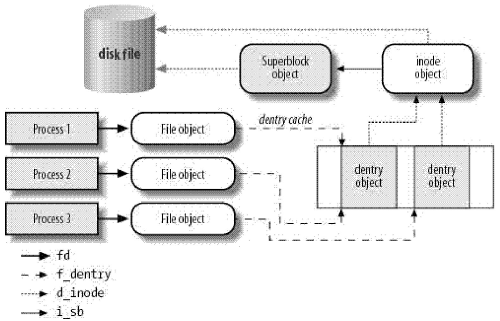

# VFS
## 通过文件模型
VFS的主要思想在于引入一个通用的文件模型,能够表示所有支持的文件系统.
* superblock
* inode: metedata information about a file.
* file: 文件与进程之间的交互信息.
* dentry: 目录项与文件进行链接的有关信息.

### super_block
~~~c
struct super_block {
        struct list_head        s_list;         /* Keep this first */
        dev_t                   s_dev;          /* search index; _not_ kdev_t */
        unsigned char           s_blocksize_bits; /* block size (bits) */
        unsigned long           s_blocksize;	/* block size (bytes) */
        loff_t                  s_maxbytes;     /* Max file size */
        struct file_system_type *s_type;	/* type of the filesystem */
        const struct super_operations   *s_op;	/* operations */
        const struct dquot_operations   *dq_op; /* 磁盘限额处理方法 */
        const struct quotactl_ops       *s_qcop; /* 磁盘限额管理方法 */
        const struct export_operations *s_export_op;	/* NFS */
        unsigned long           s_flags;	/* mount flags */
        unsigned long           s_magic;
        struct dentry           *s_root;	/* dentry of the root */
        struct rw_semaphore     s_umount;	/* semaphore for umount filesystem */
        int                     s_count;	/* reference count of the sb */
        atomic_t                s_active;	/* 次级引用计数 */
#ifdef CONFIG_SECURITY
        void                    *s_security;
#endif
        const struct xattr_handler **s_xattr;	/* 扩展属性结构的指针 */

        struct list_head        s_inodes;       /* all inodes */
        struct hlist_bl_head    s_anon;         /* anonymous dentries for (nfs) exporting */
        struct list_head        s_mounts;       /* list of mounts; _not_ for fs use */
        struct block_device     *s_bdev;	/* block device */
        struct backing_dev_info *s_bdi;		/* bdi */
        struct mtd_info         *s_mtd;
        struct hlist_node       s_instances;	/* sb list for the specific sb */
        unsigned int            s_quota_types;  /* Bitmask of supported quota types */
        struct quota_info       s_dquot;        /* Diskquota specific options */

        struct sb_writers       s_writers;

        char s_id[32];                          /* Informational name */
        u8 s_uuid[16];                          /* UUID */

        void                    *s_fs_info;     /* Filesystem private info */
        unsigned int            s_max_links;
        fmode_t                 s_mode;

        /* Granularity of c/m/atime in ns.
           Cannot be worse than a second */
        u32                s_time_gran;
        /*
         * The next field is for VFS *only*. No filesystems have any business
         * even looking at it. You had been warned.
         */
        struct mutex s_vfs_rename_mutex;        /* Kludge */

        /*
         * Filesystem subtype.  If non-empty the filesystem type field
         * in /proc/mounts will be "type.subtype"
         */
        char *s_subtype;

        /*
         * Saved mount options for lazy filesystems using
         * generic_show_options()
         */
        char __rcu *s_options;
        const struct dentry_operations *s_d_op; /* default d_op for dentries */

        /*
         * Saved pool identifier for cleancache (-1 means none)
         */
        int cleancache_poolid;

        struct shrinker s_shrink;       /* per-sb shrinker handle */

        /* Number of inodes with nlink == 0 but still referenced */
        atomic_long_t s_remove_count;

        /* Being remounted read-only */
        int s_readonly_remount;

        /* AIO completions deferred from interrupt context */
        struct workqueue_struct *s_dio_done_wq;
        struct hlist_head s_pins;

        /*
         * Keep the lru lists last in the structure so they always sit on their
         * own individual cachelines.
         */
        struct list_lru         s_dentry_lru ____cacheline_aligned_in_smp;
        struct list_lru         s_inode_lru ____cacheline_aligned_in_smp;
        struct rcu_head         rcu;

        /*
         * Indicates how deep in a filesystem stack this SB is
         */
        int s_stack_depth;
};
~~~
~~~c
/*
 * second extended-fs super-block data in memory
 */
struct ext2_sb_info {
        unsigned long s_frag_size;      /* Size of a fragment in bytes */
        unsigned long s_frags_per_block;/* Number of fragments per block */
        unsigned long s_inodes_per_block;/* Number of inodes per block */
        unsigned long s_frags_per_group;/* Number of fragments in a group */
        unsigned long s_blocks_per_group;/* Number of blocks in a group */
        unsigned long s_inodes_per_group;/* Number of inodes in a group */
        unsigned long s_itb_per_group;  /* Number of inode table blocks per group */
        unsigned long s_gdb_count;      /* Number of group descriptor blocks */
        unsigned long s_desc_per_block; /* Number of group descriptors per block */
        unsigned long s_groups_count;   /* Number of groups in the fs */
        unsigned long s_overhead_last;  /* Last calculated overhead */
        unsigned long s_blocks_last;    /* Last seen block count */
        struct buffer_head * s_sbh;     /* Buffer containing the super block */
        struct ext2_super_block * s_es; /* Pointer to the super block in the buffer */
        struct buffer_head ** s_group_desc;
        unsigned long  s_mount_opt;
        unsigned long s_sb_block;
        kuid_t s_resuid;
        kgid_t s_resgid;
        unsigned short s_mount_state;
        unsigned short s_pad;
        int s_addr_per_block_bits;
        int s_desc_per_block_bits;
        int s_inode_size;
        int s_first_ino;
        spinlock_t s_next_gen_lock;
        u32 s_next_generation;
        unsigned long s_dir_count;
        u8 *s_debts;
        struct percpu_counter s_freeblocks_counter;
        struct percpu_counter s_freeinodes_counter;
        struct percpu_counter s_dirs_counter;
        struct blockgroup_lock *s_blockgroup_lock;
        /* root of the per fs reservation window tree */
        spinlock_t s_rsv_window_lock;
        struct rb_root s_rsv_window_root;
        struct ext2_reserve_window_node s_rsv_window_head;
        /*
         * s_lock protects against concurrent modifications of s_mount_state,
         * s_blocks_last, s_overhead_last and the content of superblock's
         * buffer pointed to by sbi->s_es.
         *
         * Note: It is used in ext2_show_options() to provide a consistent view
         * of the mount options.
         */
        spinlock_t s_lock;
};
~~~
~~~c
struct super_operations {
	/* alloc a inode in inode table, and also the information in the specific filesystem*/
        struct inode *(*alloc_inode)(struct super_block *sb);
	/* destroy inode and also the information in the specific filesystem*/
        void (*destroy_inode)(struct inode *);

        void (*dirty_inode) (struct inode *, int flags);
        int (*write_inode) (struct inode *, struct writeback_control *wbc);
        int (*drop_inode) (struct inode *);
        void (*evict_inode) (struct inode *);
        void (*put_super) (struct super_block *);
        int (*sync_fs)(struct super_block *sb, int wait);
        int (*freeze_super) (struct super_block *);
        int (*freeze_fs) (struct super_block *);
        int (*thaw_super) (struct super_block *);
        int (*unfreeze_fs) (struct super_block *);
        int (*statfs) (struct dentry *, struct kstatfs *);
        int (*remount_fs) (struct super_block *, int *, char *);
        void (*umount_begin) (struct super_block *);

        int (*show_options)(struct seq_file *, struct dentry *);
        int (*show_devname)(struct seq_file *, struct dentry *);
        int (*show_path)(struct seq_file *, struct dentry *);
        int (*show_stats)(struct seq_file *, struct dentry *);
#ifdef CONFIG_QUOTA
        ssize_t (*quota_read)(struct super_block *, int, char *, size_t, loff_t);
        ssize_t (*quota_write)(struct super_block *, int, const char *, size_t, loff_t);
        struct dquot **(*get_dquots)(struct inode *);
#endif
        int (*bdev_try_to_free_page)(struct super_block*, struct page*, gfp_t);
        long (*nr_cached_objects)(struct super_block *, int);
        long (*free_cached_objects)(struct super_block *, long, int);
};
~~~

### inode
~~~c
/*
 * Keep mostly read-only and often accessed (especially for
 * the RCU path lookup and 'stat' data) fields at the beginning
 * of the 'struct inode'
 */
struct inode {
        umode_t                 i_mode;		/* file type and access mode */
        unsigned short          i_opflags;
        kuid_t                  i_uid;
        kgid_t                  i_gid;
        unsigned int            i_flags;	/* mount flags of the filesystem */

#ifdef CONFIG_FS_POSIX_ACL
        struct posix_acl        *i_acl;
        struct posix_acl        *i_default_acl;
#endif

        const struct inode_operations   *i_op;
        struct super_block      *i_sb;
        struct address_space    *i_mapping;

#ifdef CONFIG_SECURITY
        void                    *i_security;
#endif

        /* Stat data, not accessed from path walking */
        unsigned long           i_ino;		/inode num/
        /*
         * Filesystems may only read i_nlink directly.  They shall use the
         * following functions for modification:
         *
         *    (set|clear|inc|drop)_nlink
         *    inode_(inc|dec)_link_count
         */
        union {
                const unsigned int i_nlink;
                unsigned int __i_nlink;
        };
        dev_t                   i_rdev;		/* dev */
        loff_t                  i_size;		/* size of the file */
        struct timespec         i_atime;	/* access time of the last time */
        struct timespec         i_mtime;	/* modify time of the last time for file */
        struct timespec         i_ctime;	/* modify time of the last time for inode */
        spinlock_t              i_lock; /* i_blocks, i_bytes, maybe i_size */
        unsigned short          i_bytes;	/* the bytes of the last block */
        unsigned int            i_blkbits;
        blkcnt_t                i_blocks;	/* blocks num of the file */

#ifdef __NEED_I_SIZE_ORDERED
        seqcount_t              i_size_seqcount;
#endif

        /* Misc */
        unsigned long           i_state;	/* state flags */
        struct mutex            i_mutex;

        unsigned long           dirtied_when;   /* jiffies of first dirtying */

        struct hlist_node       i_hash;		/* inode hash list */
        struct list_head        i_wb_list;      /* backing dev IO list */
        struct list_head        i_lru;          /* inode LRU list */
        struct list_head        i_sb_list;	/* inodes in the sb */
        union {
                struct hlist_head       i_dentry;	/* hard link */
                struct rcu_head         i_rcu;
        };
        u64                     i_version;
        atomic_t                i_count;
        atomic_t                i_dio_count;
        atomic_t                i_writecount;
#ifdef CONFIG_IMA
        atomic_t                i_readcount; /* struct files open RO */
#endif
        const struct file_operations    *i_fop; /* former ->i_op->default_file_ops */
        struct file_lock        *i_flock;
        struct address_space    i_data;
        struct list_head        i_devices;
        union {
                struct pipe_inode_info  *i_pipe;
                struct block_device     *i_bdev;
                struct cdev             *i_cdev;
        };

        __u32                   i_generation;

#ifdef CONFIG_FSNOTIFY
        __u32                   i_fsnotify_mask; /* all events this inode cares about */
        struct hlist_head       i_fsnotify_marks;
#endif

        void                    *i_private; /* fs or device private pointer */
};
~~~

* 有效未使用的inode.
	1. i_count = 0 且非脏
	2. per filesystem lru
* 正在使用的inode
	1. i_count > 0 且非脏
	2. per filesystem lru
* dirty inode
	1. 由bdi->wb.b_dirty引用的(latest) or 由sb->s_dirty引用的(old)
~~~c
        bdi = inode_to_bdi(inode);

        spin_lock(&bdi->wb.list_lock);
        inode->dirtied_when = jiffies;
        list_move(&inode->i_wb_list, &bdi->wb.b_dirty);
        spin_unlock(&bdi->wb.list_lock);
~~~
* per filesystem 的双向链表
	sb->s_inodes

* inode_hashtable.

~~~c
struct inode_operations {
        struct dentry * (*lookup) (struct inode *,struct dentry *, unsigned int);
        void * (*follow_link) (struct dentry *, struct nameidata *);
        int (*permission) (struct inode *, int);
        struct posix_acl * (*get_acl)(struct inode *, int);

        int (*readlink) (struct dentry *, char __user *,int);
        void (*put_link) (struct dentry *, struct nameidata *, void *);

        int (*create) (struct inode *,struct dentry *, umode_t, bool);
        int (*link) (struct dentry *,struct inode *,struct dentry *);
        int (*unlink) (struct inode *,struct dentry *);
        int (*symlink) (struct inode *,struct dentry *,const char *);
        int (*mkdir) (struct inode *,struct dentry *,umode_t);
        int (*rmdir) (struct inode *,struct dentry *);
        int (*mknod) (struct inode *,struct dentry *,umode_t,dev_t);
        int (*rename) (struct inode *, struct dentry *,
                        struct inode *, struct dentry *);
        int (*rename2) (struct inode *, struct dentry *,
                        struct inode *, struct dentry *, unsigned int);
        int (*setattr) (struct dentry *, struct iattr *);
        int (*getattr) (struct vfsmount *mnt, struct dentry *, struct kstat *);
        int (*setxattr) (struct dentry *, const char *,const void *,size_t,int);
        ssize_t (*getxattr) (struct dentry *, const char *, void *, size_t);
        ssize_t (*listxattr) (struct dentry *, char *, size_t);
        int (*removexattr) (struct dentry *, const char *);
        int (*fiemap)(struct inode *, struct fiemap_extent_info *, u64 start,
                      u64 len);
        int (*update_time)(struct inode *, struct timespec *, int);
        int (*atomic_open)(struct inode *, struct dentry *,
                           struct file *, unsigned open_flag,
                           umode_t create_mode, int *opened);
        int (*tmpfile) (struct inode *, struct dentry *, umode_t);
        int (*set_acl)(struct inode *, struct posix_acl *, int);

        /* WARNING: probably going away soon, do not use! */
        int (*dentry_open)(struct dentry *, struct file *, const struct cred *);
} ____cacheline_aligned;
~~~

### file

~~~C
struct file {
	/*
	 * fu_llist becomes invalid after file_free is called and
	 * queued via fu_rcuhead for RCU freeing
	 */
        union {
                struct llist_node       fu_llist;
                struct rcu_head         fu_rcuhead;
        } f_u;
        struct path             f_path;		/* 与文件相关的目录项对象 */
        struct inode            *f_inode;       /* cached value */
        const struct file_operations    *f_op;

        /*
         * Protects f_ep_links, f_flags.
         * Must not be taken from IRQ context.
         */
        spinlock_t              f_lock;
        atomic_long_t           f_count;	//reference count 
        unsigned int            f_flags;	//flags for openning
        fmode_t                 f_mode;		//access mode
        struct mutex            f_pos_lock;
        loff_t                  f_pos;
        struct fown_struct      f_owner;
        const struct cred       *f_cred;
        struct file_ra_state    f_ra;

        u64                     f_version;	//version num, ++
#ifdef CONFIG_SECURITY
        void                    *f_security;
#endif
        /* needed for tty driver, and maybe others */
        void                    *private_data;

#ifdef CONFIG_EPOLL
        /* Used by fs/eventpoll.c to link all the hooks to this file */
        struct list_head        f_ep_links;
        struct list_head        f_tfile_llink;
#endif /* #ifdef CONFIG_EPOLL */
        struct address_space    *f_mapping;
} __attribute__((aligned(4)));  /* lest something weird decides that 2 is OK */
~~~
~~~c
struct file_operations {
        struct module *owner;
        loff_t (*llseek) (struct file *, loff_t, int);
        ssize_t (*read) (struct file *, char __user *, size_t, loff_t *);
        ssize_t (*write) (struct file *, const char __user *, size_t, loff_t *);
        ssize_t (*aio_read) (struct kiocb *, const struct iovec *, unsigned long, loff_t);
        ssize_t (*aio_write) (struct kiocb *, const struct iovec *, unsigned long, loff_t);
        ssize_t (*read_iter) (struct kiocb *, struct iov_iter *);
        ssize_t (*write_iter) (struct kiocb *, struct iov_iter *);
        int (*iterate) (struct file *, struct dir_context *);
        unsigned int (*poll) (struct file *, struct poll_table_struct *);
        long (*unlocked_ioctl) (struct file *, unsigned int, unsigned long);
        long (*compat_ioctl) (struct file *, unsigned int, unsigned long);
        int (*mmap) (struct file *, struct vm_area_struct *);
        void (*mremap)(struct file *, struct vm_area_struct *);
        int (*open) (struct inode *, struct file *);
        int (*flush) (struct file *, fl_owner_t id);
        int (*release) (struct inode *, struct file *);
        int (*fsync) (struct file *, loff_t, loff_t, int datasync);
        int (*aio_fsync) (struct kiocb *, int datasync);
        int (*fasync) (int, struct file *, int);
        int (*lock) (struct file *, int, struct file_lock *);
        ssize_t (*sendpage) (struct file *, struct page *, int, size_t, loff_t *, int);
        unsigned long (*get_unmapped_area)(struct file *, unsigned long, unsigned long, unsigned long, unsigned long);
        int (*check_flags)(int);
        int (*flock) (struct file *, int, struct file_lock *);
        ssize_t (*splice_write)(struct pipe_inode_info *, struct file *, loff_t *, size_t, unsigned int);
        ssize_t (*splice_read)(struct file *, loff_t *, struct pipe_inode_info *, size_t, unsigned int);
        int (*setlease)(struct file *, long, struct file_lock **, void **);
        long (*fallocate)(struct file *file, int mode, loff_t offset,
                          loff_t len);
        void (*show_fdinfo)(struct seq_file *m, struct file *f);
};
~~~

### dentry
~~~c
struct dentry {
        /* RCU lookup touched fields */
        unsigned int d_flags;           /* protected by d_lock */
        seqcount_t d_seq;               /* per dentry seqlock */
        struct hlist_bl_node d_hash;    /* lookup hash list */
        struct dentry *d_parent;        /* parent directory */
        struct qstr d_name;
        struct inode *d_inode;          /* Where the name belongs to - NULL is
                                         * negative */
        unsigned char d_iname[DNAME_INLINE_LEN];        /* small names */

        /* Ref lookup also touches following */
        struct lockref d_lockref;       /* per-dentry lock and refcount */
        const struct dentry_operations *d_op;
        struct super_block *d_sb;       /* The root of the dentry tree */
        unsigned long d_time;           /* used by d_revalidate */
        void *d_fsdata;                 /* fs-specific data */

        struct list_head d_lru;         /* LRU list */
        struct list_head d_child;       /* child of parent list */
        struct list_head d_subdirs;     /* our children */
        /*
         * d_alias and d_rcu can share memory
         */
        union {
                struct hlist_node d_alias;      /* inode alias list */
                struct rcu_head d_rcu;		/* reclaim */
        } d_u;
};
~~~

* Free: 由slab管理
* unused: d_count = 0, d_inode = inode.
* inuse: d_count > 0, d_inode = inode.
* negative: d_inode = NULL, in dentry_hashtable.

~~~c
struct dentry_operations {
        int (*d_revalidate)(struct dentry *, unsigned int);
        int (*d_weak_revalidate)(struct dentry *, unsigned int);
        int (*d_hash)(const struct dentry *, struct qstr *);
        int (*d_compare)(const struct dentry *, const struct dentry *,
                        unsigned int, const char *, const struct qstr *);
        int (*d_delete)(const struct dentry *);
        void (*d_release)(struct dentry *);
        void (*d_prune)(struct dentry *);
        void (*d_iput)(struct dentry *, struct inode *);
        char *(*d_dname)(struct dentry *, char *, int);
        struct vfsmount *(*d_automount)(struct path *);
        int (*d_manage)(struct dentry *, bool);
} ____cacheline_aligned;
~~~

## 数据结构的联系
### 与进程有关的文件
~~~c
struct fs_struct {
        int users;		//共享这个数据结构的进程数
        spinlock_t lock;	//
        seqcount_t seq;		//seq_lock
        int umask;		//文件位掩码
        int in_exec;
        struct path root, pwd;	//root and pwd
};
~~~

~~~c
#ifdef CONFIG_64BIT
#define BITS_PER_LONG 64
#else
#define BITS_PER_LONG 32
#endif /* CONFIG_64BIT */

/*
 * Open file table structure
 */
struct files_struct {
  /*
   * read mostly part
   */
        atomic_t count;
        struct fdtable __rcu *fdt;
        struct fdtable fdtab;
  /*
   * written part on a separate cache line in SMP
   */
        spinlock_t file_lock ____cacheline_aligned_in_smp;
        int next_fd;
        unsigned long close_on_exec_init[1];
        unsigned long open_fds_init[1];
        struct file __rcu * fd_array[NR_OPEN_DEFAULT];
};
/*
 * The default fd array needs to be at least BITS_PER_LONG,
 * as this is the granularity returned by copy_fdset().
 */
#define NR_OPEN_DEFAULT BITS_PER_LONG

struct fdtable {
        unsigned int max_fds;
        struct file __rcu **fd;      /* current fd array */
        unsigned long *close_on_exec;
        unsigned long *open_fds;
        struct rcu_head rcu;
};
~~~
~~~c
 task_struct		fs_struct
------------   |-----> ----------                          fdtable
|          |   |       |   ...  |                       -----------
|   fs     |----       |  root  |                       | max_fds |
|	   |	       |  pwd   |                       |  fd     |-----|
|   files  |----       ----------                       |         |     |
|          |   |       files_struct    ---------------->|   .     |     |
|          |   |      ------------     |  fdtable       |   .     |     |
------------   -----> |   fdt     |----- |-------|      |   .     |     |
                      |   fdtab   |------|  31   |      |         |     |
                      | fd_array  |----| |  fd   |--    -----------     |
		      -------------    | --------- |    ----------------------------
				------------	   |	| 0 | 1 | 2| ... | max_fds |
				|0|1|...|31|   <----	----------------------------
				------------
~~~

~~~c
/*
 * The caller must ensure that fd table isn't shared or hold rcu or file lock
 */
static inline struct file *__fcheck_files(struct files_struct *files, unsigned int fd)
{
        struct fdtable *fdt = rcu_dereference_raw(files->fdt);

        if (fd < fdt->max_fds)
                return rcu_dereference_raw(fdt->fd[fd]);
        return NULL;
}

static inline struct file *fcheck_files(struct files_struct *files, unsigned int fd)
{
        rcu_lockdep_assert(rcu_read_lock_held() ||
                           lockdep_is_held(&files->file_lock),
                           "suspicious rcu_dereference_check() usage");
        return __fcheck_files(files, fd);
}

static struct file *__fget(unsigned int fd, fmode_t mask)
{
        struct files_struct *files = current->files;
        struct file *file;

        rcu_read_lock();
        file = fcheck_files(files, fd);
        if (file) {
                /* File object ref couldn't be taken */
                if ((file->f_mode & mask) ||
                    !atomic_long_inc_not_zero(&file->f_count)) //判断f_count是否为0,非0加1
                        file = NULL;
        }
        rcu_read_unlock();

        return file;
}

struct file *fget(unsigned int fd)
{
        return __fget(fd, FMODE_PATH);
}
~~~

~~~c
void fput(struct file *file)
{
        if (atomic_long_dec_and_test(&file->f_count)) {
                struct task_struct *task = current;

#define PF_KTHREAD      0x00200000      /* I am a kernel thread */
                if (likely(!in_interrupt() && !(task->flags & PF_KTHREAD))) {
                        init_task_work(&file->f_u.fu_rcuhead, ____fput);
                        if (!task_work_add(task, &file->f_u.fu_rcuhead, true))
                                return;
                        /*
                         * After this task has run exit_task_work(),
                         * task_work_add() will fail.  Fall through to delayed
                         * fput to avoid leaking *file.
                         */
                }

                if (llist_add(&file->f_u.fu_llist, &delayed_fput_list))
                        schedule_delayed_work(&delayed_fput_work, 1);
        }
}

/**
 * task_work_add - ask the @task to execute @work->func()
 * @task: the task which should run the callback
 * @work: the callback to run
 * @notify: send the notification if true
 *
 * Queue @work for task_work_run() below and notify the @task if @notify.
 * Fails if the @task is exiting/exited and thus it can't process this @work.
 * Otherwise @work->func() will be called when the @task returns from kernel
 * mode or exits.
 *
 * This is like the signal handler which runs in kernel mode, but it doesn't
 * try to wake up the @task.
 *
 * RETURNS:
 * 0 if succeeds or -ESRCH.
 */
int
task_work_add(struct task_struct *task, struct callback_head *work, bool notify)
{
        struct callback_head *head;

        do {
                head = ACCESS_ONCE(task->task_works);
                if (unlikely(head == &work_exited))
                        return -ESRCH;
                work->next = head;
        } while (cmpxchg(&task->task_works, head, work) != head);

        if (notify)
                set_notify_resume(task);
        return 0;
}

/**
 * set_notify_resume - cause tracehook_notify_resume() to be called
 * @task:               task that will call tracehook_notify_resume()
 *
 * Calling this arranges that @task will call tracehook_notify_resume()
 * before returning to user mode.  If it's already running in user mode,
 * it will enter the kernel and call tracehook_notify_resume() soon.
 * If it's blocked, it will not be woken.
 */
static inline void set_notify_resume(struct task_struct *task)
{
#ifdef TIF_NOTIFY_RESUME
        if (!test_and_set_tsk_thread_flag(task, TIF_NOTIFY_RESUME))
                kick_process(task);
#endif
}

/***
 * kick_process - kick a running thread to enter/exit the kernel
 * @p: the to-be-kicked thread
 *
 * Cause a process which is running on another CPU to enter
 * kernel-mode, without any delay. (to get signals handled.)
 *
 * NOTE: this function doesn't have to take the runqueue lock,
 * because all it wants to ensure is that the remote task enters
 * the kernel. If the IPI races and the task has been migrated
 * to another CPU then no harm is done and the purpose has been
 * achieved as well.
 */
void kick_process(struct task_struct *p)
{
        int cpu;

        preempt_disable();
        cpu = task_cpu(p);
        if ((cpu != smp_processor_id()) && task_curr(p))
                smp_send_reschedule(cpu);
        preempt_enable();
}
~~~

~~~c
/**
 * task_work_run - execute the works added by task_work_add()
 *
 * Flush the pending works. Should be used by the core kernel code.
 * Called before the task returns to the user-mode or stops, or when
 * it exits. In the latter case task_work_add() can no longer add the
 * new work after task_work_run() returns.
 */
void task_work_run(void)
{
        struct task_struct *task = current;
        struct callback_head *work, *head, *next;

        for (;;) {
                /*
                 * work->func() can do task_work_add(), do not set
                 * work_exited unless the list is empty.
                 */
                do {
                        work = ACCESS_ONCE(task->task_works);
                        head = !work && (task->flags & PF_EXITING) ?
                                &work_exited : NULL;
                } while (cmpxchg(&task->task_works, work, head) != work);

                if (!work)
                        break;
                /*
                 * Synchronize with task_work_cancel(). It can't remove
                 * the first entry == work, cmpxchg(task_works) should
                 * fail, but it can play with *work and other entries.
                 */
                raw_spin_unlock_wait(&task->pi_lock);
                smp_mb();

                /* Reverse the list to run the works in fifo order */
                head = NULL;
                do {
                        next = work->next;
                        work->next = head;
                        head = work;
                        work = next;
                } while (work);

                work = head;
                do {
                        next = work->next;
                        work->func(work);
                        work = next;
                        cond_resched();
                } while (work);
        }
}
~~~
~~~c
static void ____fput(struct callback_head *work)
{
        __fput(container_of(work, struct file, f_u.fu_rcuhead));
}

/* the real guts of fput() - releasing the last reference to file
 */
static void __fput(struct file *file)
{
        struct dentry *dentry = file->f_path.dentry;
        struct vfsmount *mnt = file->f_path.mnt;
        struct inode *inode = file->f_inode;

        might_sleep();

        fsnotify_close(file);
        /*
         * The function eventpoll_release() should be the first called
         * in the file cleanup chain.
         */
        eventpoll_release(file);
        locks_remove_file(file);

        if (unlikely(file->f_flags & FASYNC)) {
                if (file->f_op->fasync)
                        file->f_op->fasync(-1, file, 0);
        }
        ima_file_free(file);
        if (file->f_op->release)
                file->f_op->release(inode, file);
        security_file_free(file);
        if (unlikely(S_ISCHR(inode->i_mode) && inode->i_cdev != NULL &&
                     !(file->f_mode & FMODE_PATH))) {
                cdev_put(inode->i_cdev);
        }
        fops_put(file->f_op);
        put_pid(file->f_owner.pid);
        if ((file->f_mode & (FMODE_READ | FMODE_WRITE)) == FMODE_READ)
                i_readcount_dec(inode);
        if (file->f_mode & FMODE_WRITER) {
                put_write_access(inode);
                __mnt_drop_write(mnt);
        }
        file->f_path.dentry = NULL;
        file->f_path.mnt = NULL;
        file->f_inode = NULL;
        file_free(file);
        dput(dentry);
        mntput(mnt);
}

static void file_free_rcu(struct rcu_head *head)
{
        struct file *f = container_of(head, struct file, f_u.fu_rcuhead);

        put_cred(f->f_cred);
        kmem_cache_free(filp_cachep, f);
}

static inline void file_free(struct file *f)
{
        percpu_counter_dec(&nr_files);
        call_rcu(&f->f_u.fu_rcuhead, file_free_rcu);
}
~~~

### Inode高速缓存
VFS用了一个高速缓存来加快对索引节点的访问.
* in_use
* dirty
* unused: i_count = 0.

static struct hlist_head *inode_hashtable __read_mostly;
* 全局哈希表inode_hashtable,其中哈希值是根据每个超级块指针的值和32位索引节点号而得.
	insert_inode_hash(struct inode *);
* sb->s_inodes
* sb->s_inode_lru
* sb->bdi->wb.b_dirty
* slub

### Dentry高速缓存
* 一个处于正在使用,未使用或负状态的目录对象的集合.
* 一个散列表,从中能够快速获取与给定的文件名和目录名对应的目录项对象.

	1. dentry_hashtable
	2. sb->s_dentry_lru
	3. slub
	4. inode->i_dentry/dentry->d_alias

### VFS实现
mount -t ext2 /dev/sdb2 /mnt/test
  do_mount
    do_new_mount
      get_fs_type
      vfs_kern_mount
        mount_fs
	  mount_bdev
      do_add_mount
