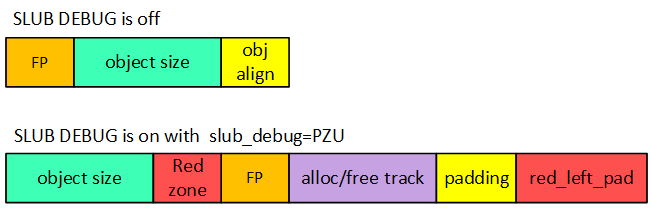
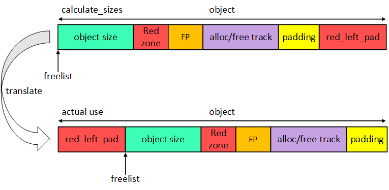
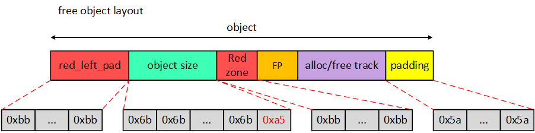

# SLUB DEBUG
* slub debug
* kasan

* slub debug: 检测oob(out of bounds)问题原理也很简单,既然为了发现是否越界，那么就在分配出去的内存尾部添加一段额外的内存，填充特殊数字(magic num).
	      只需要检测这块额外的内存的数据是否被修改就可以知道是否发生了oob情况.而这段额外的内存就叫做Redzone.

~~~c
CONFIG_SLUB=y
CONFIG_SLUB_DEBUG=y
CONFIG_SLUB_DEBUG_ON=y  <==>  slub_debug=crpu
~~~

SLUBU DEBUG关闭的情况下，free pointer是内嵌在object之中的，但是SLUB DEBUG打开之后，free pointer是在object之外，并且多了很多其他的内存，例如red zone、trace和red_left_pad等.

SLUB allocator在初始化slab缓存池的时候会做一个转换.

~~~c
#define SLUB_RED_INACTIVE   0xbb
#define SLUB_RED_ACTIVE     0xcc
/* ...and for poisoning */
#define POISON_INUSE         0x5a    /* for use-uninitialised poisoning */
#define POISON_FREE          0x6b    /* for use-after-free poisoning */
#define POISON_END           0xa5    /* end-byte of poisoning */
~~~

