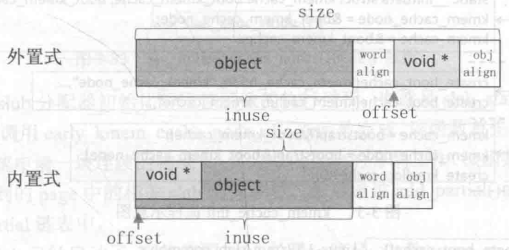
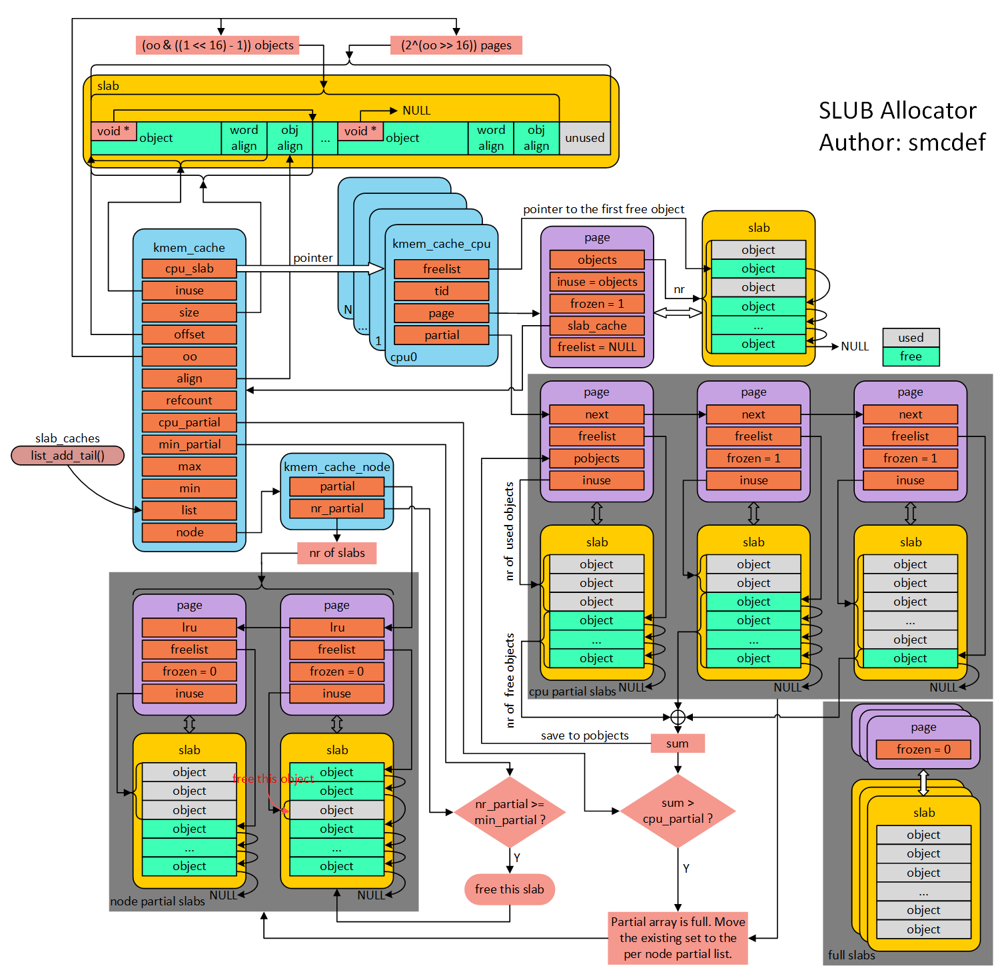
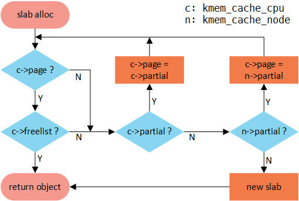
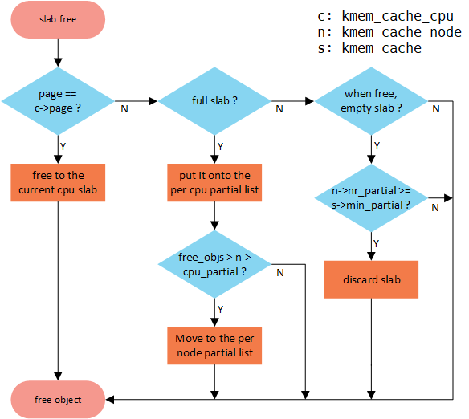

# Slub allocator
Linux的物理内存管理采用了以页为单位的buddy system,但多数情况下,内核仅仅需求一个较小的对象,而且这些小块的空间对于不同对象又是变化的,不可预测的,所以需求一种类似用户空间堆内存管理机制.然而内核对象的管理有一定的特殊性,有些对象频繁访问,需采用缓存机制;对象的组织需考虑硬件cache的影响.需要考虑多处理器以及NUMA架构的影响.
多年以来,SLAB称为Linux kernel对象缓存区的主要算法,在大多数情况下，它的工作完成的相当不错.但是随着多处理器系统和NUMA系统的广泛应用,slab分配器暴露了以下的严重不足:
* 缓存队列管理复杂
* 管理数据存储开销大
* 对NUMA支持复杂
* 调试调优困难
* slab着色机制效果不明显

针对这些不足,在2.6.22中引入一种新的解决方案:SLUB分配器.Slub分配器特点:
* 简化设计理念,同时保留slab分配器的基本思想
* 每个缓冲区由多个小的slab组成,每个slab包含固定数目的对象
* slub简化了kmem_cache, slab等相关的管理数据结构

## Data structure
~~~c
/*
 * Slab cache management.
 */
struct kmem_cache {
        struct kmem_cache_cpu __percpu *cpu_slab; //本地内存池,优先从本地cpu分配内存以保证cache的命中率
        /* Used for retriving partial slabs etc */
        unsigned long flags;	//object分配掩码,i.e. SLAB_HWCACHE_ALIGN:object按照硬件cache 对齐
        unsigned long min_partial; //限制struct kmem_cache_node中的partial链表slab的数量,大于
    								这个mini_partial的值，那么多余的slab就会被释放
        int size;               /* The size of an object including meta data */
        int object_size;        /* The size of an object without meta data */
        int offset;             /* Free pointer offset. */ //每个object在没有分配之前,完全可以
    							   在每个object中存储下一个object内存首地址，就形成了一个单链表,
    							   offset就是存储下个object地址数据相对于这个object首地址的偏移
        int cpu_partial;        /* Number of per cpu partial objects to keep around */ 									//per_cpu partial中所有slab的free object的数量的最大值，超过这
    							  个值就会将所有的slab转移到kmem_cache_node的partial链表
        struct kmem_cache_order_objects oo; //低16位代表一个slab中所有object的数量,高16位代表一个slab管理的page数量
 
        /* Allocation and freeing of slabs */
        struct kmem_cache_order_objects max; //oo
        struct kmem_cache_order_objects min; //内存不足时,采用min分配,参考oo
        gfp_t allocflags;       /* gfp flags to use on each alloc */ //alloc_pages(, allocflags)
        int refcount;           /* Refcount for slab cache destroy */
        void (*ctor)(void *);
        int inuse;              /* Offset to metadata */ //object_size按字节对齐的大小
        int align;              /* Alignment */	//
        int reserved;           /* Reserved bytes at the end of slabs */
        const char *name;       /* Name (only for display!) */
        struct list_head list;  /* List of slab caches */
#ifdef CONFIG_SYSFS
        struct kobject kobj;    /* For sysfs */
#endif 
#ifdef CONFIG_MEMCG_KMEM
        struct memcg_cache_params *memcg_params;
        int max_attr_size; /* for propagation, maximum size of a stored attr */
#ifdef CONFIG_SYSFS
        struct kset *memcg_kset;
#endif
#endif

#ifdef CONFIG_NUMA
        /*
         * Defragmentation by allocating from a remote node.
         */
        int remote_node_defrag_ratio;
#endif
        struct kmem_cache_node *node[MAX_NUMNODES]; //NUMA系统中，每个node都有一个struct kmem_cache_node数据结构
};
~~~

~~~c
struct kmem_cache_cpu {
        void **freelist;        /* Pointer to next available object */
        unsigned long tid;      /* Globally unique transaction id */ //主要用来同步作用
        struct page *page;      /* The slab from which we are allocating */
        struct page *partial;   /* Partially allocated frozen slabs */ //slab partial链表。主要是一些部分使用object的slab
#ifdef CONFIG_SLUB_STATS
        unsigned stat[NR_SLUB_STAT_ITEMS];
#endif
};
~~~
~~~c
/*
 * The slab lists for all objects.
 */
struct kmem_cache_node {
        spinlock_t list_lock;
#ifdef CONFIG_SLUB
        unsigned long nr_partial;  //slab节点中slab的数量
        struct list_head partial;  //
#ifdef CONFIG_SLUB_DEBUG
        atomic_long_t nr_slabs;
        atomic_long_t total_objects;
        struct list_head full;
#endif
#endif
};
~~~

~~~c
struct page {
	struct {
		union {
			void * freelist;	/* sl[aou]b first free object */
						//本页帧中第一个空闲的obj
		};
		union {
#if defined(CONFIG_HAVE_CMPXCHG_DOUBLE) && \
	defined(CONFIG_HAVE_ALIGNED_STRUCT_PAGE)
			/* Used for cmpxchg_double in slub */
			unsigned long counters;
#else
			/*
			 * Keep _count separate from slub cmpxchg_double data.
			 * As the rest of the double word is protected by
			 * slab_lock but _count is not.
			 */
			unsigned counters;
#endif
			struct {
				union {
					struct { /* SLUB */
						unsigned inuse:16;	//used obj nums
						unsigned objects:15;	//total obj nums
						unsigned frozen:1;	//被某CPU独占
					};
				};
				atomic_t _count;	/* Usage count, see below*/
			};
		};
		/* Third double word block */
		union {
			struct list_head lru;   /* Pageout list, eg. active_list
						 * protected by zone->lru_lock !
						 * Can be used as a generic list
						 * by the page owner.
						 */
			struct {		/* slub per cpu partial pages */
				struct page *next;      /* Next partial slab */
#ifdef CONFIG_64BIT
				int pages;      /* Nr of partial slabs left */
				int pobjects;   /* Approximate # of objects */
						//free obj nums
#else
				short int pages;
				short int pobjects;
#endif
			};
		};
		/* Remainder is not double word aligned */
		union {
			struct kmem_cache *slab_cache;		/* SL[AU]B: Pointer to slab */
			struct page *first_page;        /* Compound tail pages */
		};
	};
};
~~~

## Slub初始化
* 申请struct kmem_cache, struct kmem_cache_node的kmem_cache
* kmalloc的kmem_cache

### Kmem_cache的kmem_cache
~~~c
void __init kmem_cache_init(void)
{
	//声明静态变量，存储临时kmem_cache管理结构
        static __initdata struct kmem_cache boot_kmem_cache,
                boot_kmem_cache_node;

        kmem_cache_node = &boot_kmem_cache_node;
        kmem_cache = &boot_kmem_cache;

	//申请slub缓冲区，管理数据放在临时结构中
        create_boot_cache(kmem_cache_node, "kmem_cache_node",
                sizeof(struct kmem_cache_node), SLAB_HWCACHE_ALIGN);

        register_hotmemory_notifier(&slab_memory_callback_nb);

        /* Able to allocate the per node structures */
        slab_state = PARTIAL;

        create_boot_cache(kmem_cache, "kmem_cache",
                        offsetof(struct kmem_cache, node) +
                                nr_node_ids * sizeof(struct kmem_cache_node *),
                       SLAB_HWCACHE_ALIGN);

	//从刚才挂在临时结构的缓冲区中申请kmem_cache的kmem_cache，并将管理数据拷贝到新申请的内存中
        kmem_cache = bootstrap(&boot_kmem_cache);

        /*
         * Allocate kmem_cache_node properly from the kmem_cache slab.
         * kmem_cache_node is separately allocated so no need to
         * update any list pointers.
         */
        kmem_cache_node = bootstrap(&boot_kmem_cache_node);

        /* Now we can use the kmem_cache to allocate kmalloc slabs */
        create_kmalloc_caches(0);

#ifdef CONFIG_SMP
        register_cpu_notifier(&slab_notifier);
#endif
}
~~~
~~~c
/********************************************************************
 *                      Basic setup of slabs
 *******************************************************************/

/*
 * Used for early kmem_cache structures that were allocated using
 * the page allocator. Allocate them properly then fix up the pointers
 * that may be pointing to the wrong kmem_cache structure.
 */

static struct kmem_cache * __init bootstrap(struct kmem_cache *static_cache)
{
        int node;
        struct kmem_cache *s = kmem_cache_zalloc(kmem_cache, GFP_NOWAIT);
        struct kmem_cache_node *n;

        memcpy(s, static_cache, kmem_cache->object_size);

        /*
         * This runs very early, and only the boot processor is supposed to be
         * up.  Even if it weren't true, IRQs are not up so we couldn't fire
         * IPIs around.
         */
        __flush_cpu_slab(s, smp_processor_id());
        for_each_kmem_cache_node(s, node, n) {
                struct page *p;

                list_for_each_entry(p, &n->partial, lru)
                        p->slab_cache = s;

#ifdef CONFIG_SLUB_DEBUG
                list_for_each_entry(p, &n->full, lru)
                        p->slab_cache = s;
#endif
        }
        list_add(&s->list, &slab_caches);
        return s;
}
~~~

### Kmalloc

~~~c
/*
 * Create the kmalloc array. Some of the regular kmalloc arrays
 * may already have been created because they were needed to
 * enable allocations for slab creation.
 */
void __init create_kmalloc_caches(unsigned long flags)
{
        int i;

        /*
         * Patch up the size_index table if we have strange large alignment
         * requirements for the kmalloc array. This is only the case for
         * MIPS it seems. The standard arches will not generate any code here.
         *
         * Largest permitted alignment is 256 bytes due to the way we
         * handle the index determination for the smaller caches.
         *
         * Make sure that nothing crazy happens if someone starts tinkering
         * around with ARCH_KMALLOC_MINALIGN
         */
        BUILD_BUG_ON(KMALLOC_MIN_SIZE > 256 ||
                (KMALLOC_MIN_SIZE & (KMALLOC_MIN_SIZE - 1)));

        for (i = 8; i < KMALLOC_MIN_SIZE; i += 8) { 
                int elem = size_index_elem(i);

                if (elem >= ARRAY_SIZE(size_index))
                        break;
                size_index[elem] = KMALLOC_SHIFT_LOW;
        }

        if (KMALLOC_MIN_SIZE >= 64) {
                /*
                 * The 96 byte size cache is not used if the alignment
                 * is 64 byte.
                for (i = 64 + 8; i <= 96; i += 8)
                        size_index[size_index_elem(i)] = 7;

        }

        if (KMALLOC_MIN_SIZE >= 128) {
                /*
                 * The 192 byte sized cache is not used if the alignment
                 * is 128 byte. Redirect kmalloc to use the 256 byte cache
                 * instead.
                 */
                for (i = 128 + 8; i <= 192; i += 8)
                        size_index[size_index_elem(i)] = 8;
        }
        for (i = KMALLOC_SHIFT_LOW; i <= KMALLOC_SHIFT_HIGH; i++) {
                if (!kmalloc_caches[i]) {
                        kmalloc_caches[i] = create_kmalloc_cache(NULL,
                                                        1 << i, flags);
                }

                /*
                 * Caches that are not of the two-to-the-power-of size.
                 * These have to be created immediately after the
                 * earlier power of two caches
                 */
                if (KMALLOC_MIN_SIZE <= 32 && !kmalloc_caches[1] && i == 6)
                        kmalloc_caches[1] = create_kmalloc_cache(NULL, 96, flags);

                if (KMALLOC_MIN_SIZE <= 64 && !kmalloc_caches[2] && i == 7)
                        kmalloc_caches[2] = create_kmalloc_cache(NULL, 192, flags);
        }

        /* Kmalloc array is now usable */
        slab_state = UP;

        for (i = 0; i <= KMALLOC_SHIFT_HIGH; i++) {
                struct kmem_cache *s = kmalloc_caches[i];
                char *n;

                if (s) {
                        n = kasprintf(GFP_NOWAIT, "kmalloc-%d", kmalloc_size(i));

                        BUG_ON(!n);
                        s->name = n;
                }
        }
#ifdef CONFIG_ZONE_DMA
        for (i = 0; i <= KMALLOC_SHIFT_HIGH; i++) {
                struct kmem_cache *s = kmalloc_caches[i];

                if (s) {
                        int size = kmalloc_size(i);
                        char *n = kasprintf(GFP_NOWAIT,
                                 "dma-kmalloc-%d", size);

                        BUG_ON(!n);
                        kmalloc_dma_caches[i] = create_kmalloc_cache(n,
                                size, SLAB_CACHE_DMA | flags);
                }
        }
#endif
}
~~~

## Slub API
~~~c
* struct kmem_cache *kmem_cache_create(const char *name,
        size_t size,
        size_t align,
        unsigned long flags,
        void (*ctor)(void *));
* void kmem_cache_destroy(struct kmem_cache *);
* void *kmem_cache_alloc(struct kmem_cache *cachep, int flags);
* void kmem_cache_free(struct kmem_cache *cachep, void *objp);
~~~

## Slub管理object

* slab缓冲池包含的页数是由oo决定的.oo拆分为两部分,低16位代表一个slab缓冲池中obj的数量,高16位代表slab包含的页数.即从伙伴系统得到2^(oo>>16)pages的内存.
* per_cpu->freelist: 本地缓冲池,freelist成员指向第一个可用内存obj首地址.
* per_cpu->partial:
* node->partial: node中的slab是共享的,per_cpu->partial是独占的.

## kmem_cache_alloc

## kmem_cache_free

